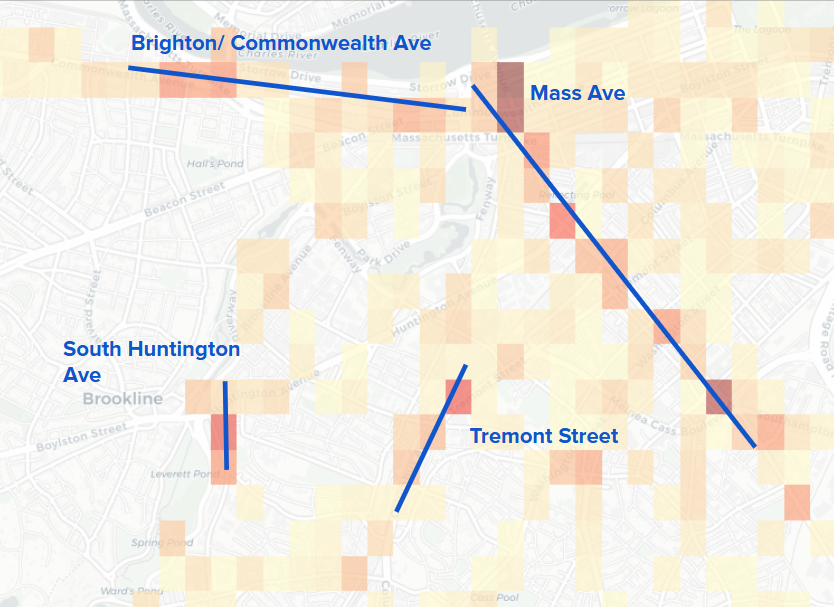
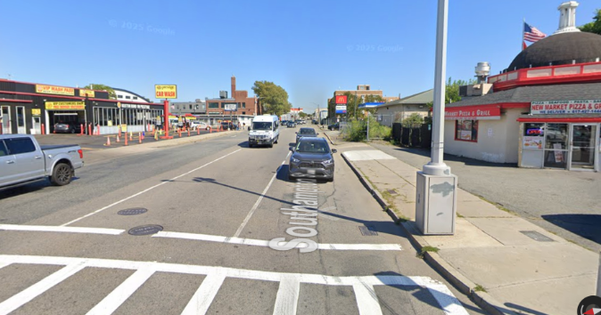
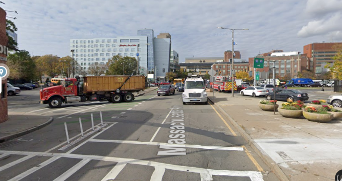
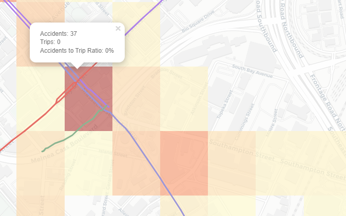
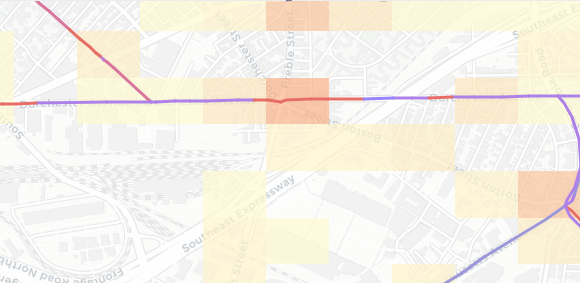
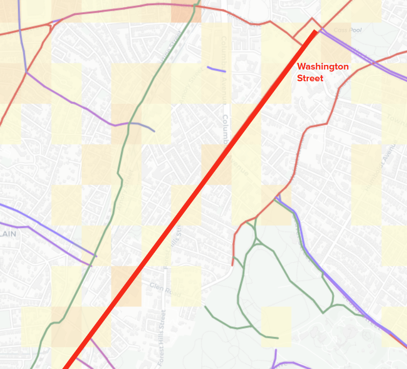

```{r, include=FALSE}
library(tidyverse)
library(lubridate)
library(leaflet) 
library(leaflet)
library(dplyr)
library(readr)
library(lubridate)
library(glue)
library(janitor)
library(DT)            
library(ggmap)         
library(RColorBrewer) 
library(sf)            
library(gplots)       
library(choroplethr)  
library(choroplethrMaps)
library(maps)
library(ggthemes)
library(leaflet.extras)
library(htmlwidgets) # for amanda's legend
library(patchwork)
library(gridExtra)
library(ggplot2)
```

## Introduction

Bicycling is one of the most popular urban mobility alternatives to cars. Most cities often have bike programs to expand access to biking and develop infrastructure to ensure safety when biking. However, even with these improvements, accidents can occur, leading to questions on safety and the factors that can contribute to more bicycle accidents in the busy city. Over the decades, Boston has undertaken to expand its bike lane network to promote safer, more sustainable transportation, accompanied with large amounts of data collected by the government that are freely accessible to all. With such resources, we decided to investigate bike accidents that occurred within the Boston—specifically only in the Suffolk county limits of Boston city—to identify any general trends and also if there were any geographical hotspots and briefly investigate why it is a hotspot and if focusing bike safety improvements in these hotspots would be effective ways to improve bike safety in Boston.

```{r,include=FALSE}
#All Data Loading 

data <- read_csv("./data/Bike_Crash_Data_Vision_Zero.csv")
bike <- data |>
  filter(mode_type == "bike") |>
  mutate(
    dispatch_ts = ymd_hms(dispatch_ts),
    date = as_date(dispatch_ts),
    year = year(dispatch_ts),
    month = month(date),
    season = case_when(
            month(date) %in% c(12, 1, 2) ~ "Winter",
            month(date) %in% c(3, 4, 5) ~ "Spring",
            month(date) %in% c(6, 7, 8) ~ "Summer",
            month(date) %in% c(9, 10, 11) ~ "Fall"
          ),
    hour = hour(dispatch_ts) )

#Blue Bikes Trip Summary
all_summary <- read.csv("./data/all_trips_summary.csv")


#Blue Bikes Import Total Trip Count Per Start Station with Coordinations and Filter Out Stations Outside of Boston
total_counts <- read.csv("./data/total_counts_with_coord.csv")
total_counts <- head(total_counts, -1) |>
  #only in boston
  filter((42.237210 < start_lat & start_lat < 42.400739) & 
         ( -71.186470 < start_lng & start_lng < -70.985085)) |>
  
  #cambridge
  filter(!(
    start_lat > 42.355417 & start_lat < 42.425723 &
    start_lng > -71.114138 & start_lng < -71.088989
  )) |>
  
  #somerville
  #42.374595, -71.168457
  #42.432250, -71.098786
  filter(!(
    start_lat > 42.374595 & start_lat < 42.432250 &
    start_lng > -71.168457 & start_lng < -71.098786
  )) |>

  #harvard
  # 42.370632, -71.124589
  # 42.377532, -71.115612
  filter(!(
    start_lat > 42.370632 & start_lat < 42.377532 &
    start_lng >  -71.124589 & start_lng < -71.115612
  )) |>

  #42.364358, -71.117201
  #42.371603, -71.113690
  filter(!(
    start_lat > 42.364358 & start_lat <42.371603 &
    start_lng > -71.117201 & start_lng < -71.113690
  )) |>
  
  #42.355546, -71.094754
  #42.380322, -71.079337
  filter(!(
    start_lat >42.355546 & start_lat < 42.380322 &
    start_lng > -71.094754 & start_lng <  -71.079337
  )) 

total_counts <- total_counts |>
  filter(!is.na(start_lat), !is.na(start_lng), !is.na(n))


#Amanda's section & bike lane data
boston_crashes_raw <- bike
bike_network <- st_read("./data/existing_bike_network_2024.json") %>% 
  st_transform(4326) # Ensure WGS84 for Leaflet
head(bike_network)

bike_network_2022 <- st_read("./data/existing_bike_network_2022.json") %>% 
  st_transform(4326) # Ensure WGS84 for Leaflet
head(bike_network_2022)
```

## General Insights and Visualizations.

For our first pass at bike accident investigations, we wanted to see if there were any overall trends, not purely geographical, that could contribute to higher accident rates. For this, we leveraged the accidents dataset provided by Vision Zero ([Vision Zero Boston, 2015-2026](https://experience.arcgis.com/experience/bae68e65908f45e1bcc86fe5f089d266/page/Main-Grid-after-9%2F3)) which collected bike accident data in Boston for the past decade. We decided to see if there were any trends for crash data based on time, as shown by the bar charts below.

### Yearly Boston Bike Accidents

##### Yearly reported bike accidents in Boston showcase decreasing trend over time

```{r, echo=FALSE}

ggplot(bike, aes(x = year)) +
  geom_bar(fill="blue") +
  labs(
    title = "Bike Accidents Per Year",
    x = "Year",
    y = "Number of Crashes"
  ) +
  theme_minimal()


```

The general visualizations on accidents show that bike accidents have steadily been decreasing each year, and that during a 24 hour period, for all years except during the pandemic there are often spikes in accidents during rush hour (8am-10am and 5pm-6pm) Overall, the data corroborated pre-existing assumptions on bike accidents like how rush hour is when there are the most accidents (probably due to the heightened volume of bike and car traffic in general). For Boston, the yearly bike accident trends showed no irregularities and in fact displayed a slow decrease in accidents over the past decade, even when we ignore the decrease due to the pandemic (2020-2022) when there were just less people going outside. This decrease could be attributed to Boston’s continual infrastructure work on bike safety that has occurred starting in 2018, as outlined on the Boston government's [website page](https://www.boston.gov/departments/transportation/safer-more-accessible-walking-and-biking) on bike infrastructure work which showcases all their projects to build more bike lines and more.

We can also look at the time based on the season, and the overall data is not surprising.

### Boston Bike Accidents By Season

##### Bike accidents separated by season over 24 hours shows seasonal trends

```{r, echo=FALSE}

ggplot(bike, aes(x = hour, fill=season)) +
  geom_histogram(binwidth=1) +
  facet_wrap(season ~.)+
  labs(
    title = "Distribution of Crash Times",
    x = "Hour of Day",
    y = "Number of Crashes"
  ) +
  theme_minimal()

```

There were less bike accidents during seasons like winter when there would also just be less bicyclists in general, and summer was peak accidents, which makes sense given it's also the season when people would be biking due to the amicable weather. To better see if these trends corresponded to general volume of bike traffic, we also utilized the Bluebikes dataset ([Bluebikes, 2011-2025](https://bluebikes.com/system-data)) (Bluebikes are Boston’s street bike rental service) as a rough indicator of how many bicyclists traverse Boston each day for the past decade. While we acknowledge that Bluebikes trip data does not accurately reflect bike data and may skew to more casual bicyclists compared to more serious bicyclists who personally own their bikes, it is a solid reference point to use for bike traffic given there are no public datasets tracking bicyclist traffic One additional thing to note about the Bluebikes data is during data processing, it was found that 2023 several months of data were invalid (NAs) and could not be used. Given the number of invalid months was larger than valid months, we stripped 2023 data from the dataset.

When overlaying the graphs, we can see that bicycle accidents in Boston have steadily been decreasing while the number of bike trips via Bluebikes have increased. While Bluebike trip increases causation may be due to station expansions as adoption increases, it’s important to note that it still does show that there are more and more bikes being used Boston each year.

### Bluebikes Usage VS Bike Accidents

##### A comparison graph of increasing bike trips in Boston via Bluebikes in the past decade versus the declining bike accidents in Boston

```{r, echo=FALSE}

df_year <- all_summary |>
  group_by(year) |>
  summarise(
    total_trips = sum(total_trips),
    total_accidents = sum(total_accidents),
    .groups = "drop"
  )


p1 <- ggplot(df_year, aes(x = factor(year), y = total_trips)) +
  geom_col(fill = "steelblue", alpha = 0.7) +
  scale_y_continuous(labels = scales::comma)+
  labs(
    title = "Total Annual Bike Trips", 
    x = NULL,
    y = "Trips"
  ) +
  theme_minimal()

p2 <- ggplot(df_year, aes(x = factor(year), y = total_accidents)) +
  geom_line(aes(group = 1), color = "red", linewidth = 1.2) +
  geom_point(color = "red", size = 2) +
  labs(
    title = "Total Annual Bike Accidents",
    x = "Year",
    y = "Accidents"
  ) +
  theme_minimal()

p1 / p2

```

We also overlaid geographically the bicycle accidents on the map and each blue bikes station on the map (sized and colored based on volume of trips taken from the station) to see if there were any interesting trends. One thing we can gather from this map is that there is no obvious trend between stations with higher traffic and bike accidents in Boston. In fact, it looks as if the higher density areas (like Massachusetts Avenue) this visual does not indicate if there are more accidents in these high Bluebikes traffic than areas without them, like Dorchester Avenue. Further investigation into this will be done with visualizations further below, but this visual does prove that there is more than a simple linear correlation between higher traffic and accidents.

### Bike Accidents and Bluebike Stations in Boston

##### Geographically plotted bike accidents locations in relation to Bluebike stations with indication of trip volume in the past decade

```{r, echo=FALSE}
bike <- bike |>
  filter(!is.na(lat), !is.na(long))

pal <- colorNumeric(
  palette = "YlOrRd",
  domain = total_counts$n
)

#Station Data
leaflet()|>
  setView(lng = -71.1, lat = 42.35, zoom = 13) |>  # Boston area
  addTiles() |>
  addCircles(
    data = total_counts,
    lat = ~start_lat,
    lng = ~start_lng,
    radius = ~sqrt(n)/3, #Stations with More Trips Are darler & have larger radius
    fillColor = ~pal(n),
    stroke= FALSE,
    fillOpacity = 0.5,   # lower = more blending
  ) |>
  
  #Accident Data
    addCircleMarkers(
    data = bike,
    lat = ~lat,
    lng = ~long,
    radius = 2,
    color = "blue",
    stroke= FALSE,
    fillOpacity = 0.7,
  ) |>
  addProviderTiles(providers$CartoDB.Positron) |>

  addLegend(
    position = "bottomright",
    pal = pal,
    values = total_counts$n,
    title = "Number of Blue Bike Trips Per Station",
    opacity = 0.8
  )


```

## Geographic Investigations

Continuing with our geographic analysis, we shifted our focus into identifying any geographic trends with the accidents. Given several statistics reported by [others](https://www.cdc.gov/pedestrian-bike-safety/about/bicycle-safety.html) indicated higher chances of accidents/death for bicyclists at intersections, we used the Vision Zero dataset to see the different categorizations of accidents and where they occurred (street, intersection, etc). We summed up all the accidents at intersections, streets, and other locations over the past decade as well as yearly visualizations of each.

Bar charts of Accidents

```{r, echo=FALSE}
table(bike$location_type)

all_crashes <- ggplot(bike, aes(x=year)) +
  geom_bar(fill="black") +
  labs(x="Year", y="Number of Crashes")

faceted_crashes <- ggplot(bike, aes(x=year)) +
  geom_bar(aes(fill=location_type)) +
  labs(x="Year", y="Number of Crashes") +
  facet_grid(rows=vars(location_type))

crash_year_plots <- all_crashes | faceted_crashes
crash_year_plots + plot_annotation(title="Number of Bike Crashes per Year")
```

We investigated where each accident occurred, specifically if it was at an intersection or a street, with a catch-all “other” category for the rest. We found that for the past decade the cumulative number of intersections and street accidents are almost the same, superficially disproving the idea that most accidents occur at intersections. However, if we do a year by year breakdown we can actually see that while street only accidents more or less mirror the overall behavior of all accidents, intersection specific accidents have been steadily decreasing over the decades, to the point where in more recent years there are less interesection accidents than street accidents. This may be attributed with the fact that Boston could be been focusing on improving bike safety specifically at intersections because they've been identified as high accident zones. Overall, this high level analysis confirms that over the past decade, intersection and street accidents have had similar rates of risk, though there seems to be some factor that has been decreasing intersection accidents over the years.

While plotting individual accidents can be useful, a more simplified view can give us better insights into whether there are any significant trends. One such way is to utilize a heatmap.To make the visualization even more simplified, a grided heatmap of the accidents was made to clearly showcase areas of high accidents. Using leaflet, we also were able to make it interactive to give information on the total number of accidents in that geographic grid, number of trips made from the stations in the grid, and the accidents-to-trips ratio. We made two separate grid views as well.

### Grid Heatmap of Accidents in Boston

##### A simplified heatmap geographically showing total bike accidents per geographic cell to highlight accident hotspots

```{r, echo=FALSE}
cell_size <- 0.002 #Grid Cell Size  

acc_grid <- bike |>
  mutate(
    lat_bin = floor(lat / cell_size) * cell_size,
    lng_bin = floor(long / cell_size) * cell_size
  )

bike_grid <- total_counts |>
  mutate(
    lat_bin = floor(start_lat / cell_size) * cell_size,
    lng_bin = floor(start_lng / cell_size) * cell_size
  )

# Count accidents per grid cell
acc_counts <- acc_grid |>
  group_by(lat_bin, lng_bin) |>
  summarize(bike = n(), .groups = "drop")

# Count Bike Trips Per Grid
bike_counts <- bike_grid |>
  group_by(lat_bin, lng_bin) |>
  summarize(trips = sum(n), .groups = "drop")  # ← Changed from n() to sum()

grid_data <- full_join(acc_counts, bike_counts,
                       by = c("lat_bin", "lng_bin")) |>
  mutate(
    bike = ifelse(is.na(bike), 0, bike),
    trips = ifelse(is.na(trips), 0, trips),
    rate = ifelse(trips == 0, 0, bike / trips)
  )

#Take out squares with only 1 accident
grid_data <- grid_data |>
  filter(bike > 1)


# No cap — full range
pal <- colorNumeric(
  palette = c("#fff7bc", "red", "#7f0000"),
  domain = grid_data$bike,
  na.color = "transparent"
)

leaflet(grid_data) |>
  setView(lng = -71.1, lat = 42.35, zoom = 12) |>  # Boston area
  addTiles() |>
  addRectangles(
    lng1 = ~lng_bin,
    lat1 = ~lat_bin,
    lng2 = ~lng_bin + cell_size,
    lat2 = ~lat_bin + cell_size,
    fillColor = ~pal(bike),  
    fillOpacity = 0.7,
    color = NA,
    popup = ~paste0(
      "Accidents: ", bike, "<br>",
      "Trips: ", trips, "<br>",
      "Accidents to Trip Ratio: ", round(rate * 100, 2), "%"
    )
  ) |>
      addProviderTiles(providers$CartoDB.Positron) |>

  addLegend(
    pal = pal,
    values = ~bike,
    opacity = 0.7,
    title = "Accidents Count"
  )

```

The first is a standard grid view of accidents per geographic grid. We can see visually that Massachusetts Avenue and Brighton/Commonwealth Avenue have consistent streams of accidents along the road and intersections on it. This makes sense since these are areas with high traffic, thus accidents would probably occur here. However, areas like South Huntington Avenue and Tremont street also had noticeably high numbers of accidents in the past decade compared to other streets, something we did not expect.

### Heatmap of Accidents in Boston with Hotspot Roads

##### Visualization highlighting hotspot roads overlaid as shown by the heatmap

```         
```



Now, given that this view does not take into account the sheer volume of trips taken in busy areas for the number of bike accidents, we made a visualization where we normalized each grid based on the accidents-to-trips ratio—simply taking the total number of accidents in the geographic area and then dividing it by the number of blue bike trips started in the geographic grid—to estimate how the map would look like normalized. This figure showcases areas where the percentage of accidents in relation to trips are higher than the number of trips started there. Unlike our first grid heatmap, we can see that this visualization highlights different locations, and high accident prone areas, like Massachusetts Avenue, do not stick out because their accident percentage is almost 0% of all trips taken there. Using this view, we can see that random spots in Back Bay, Boylston, and near Tufts Medical center have 1% of all trips started there were accidents.

### Grid Heatmap of Accidents-to-Trips Ratio in Boston

##### A simplified heatmap geographically showing total accidents-to-trips ratio to highlight accident hotspots

```{r, echo=FALSE}
pal <- colorNumeric(
  palette = c("#fff7bc", "red", "#7f0000"),
  domain = grid_data$rate,
  na.color = "transparent"
)

leaflet(grid_data)|>
  setView(lng = -71.1, lat = 42.35, zoom = 12) |>  # Boston area
  addTiles() |>
  addRectangles(
    lng1 = ~lng_bin,
    lat1 = ~lat_bin,
    lng2 = ~lng_bin + cell_size,
    lat2 = ~lat_bin + cell_size,
    fillColor = ~pal(rate),
    fillOpacity = 0.7,
    color = NA,
    popup = ~paste0(
      "Accidents: ", bike, "<br>",
      "Trips: ", trips, "<br>",
      "Accidents to Trip Ratio: " ,round(rate * 100, 2), "%"
    )
  ) |>
      addProviderTiles(providers$CartoDB.Positron) |>

   addLegend(
    pal = pal,
    values = ~rate,  
    labFormat = labelFormat(suffix = "%", transform = function(x) x * 100),
    title = "Accidents to Total Trips Ratio"
  )
```

However, given that we only can use the data from trips started in particular stations, it’s only a rough estimate to how busy each geographic square is, and this visualization needs to be looked in the context of the other visualizations to guide our understanding and investigations. Furthermore, A grid cell on South Huntington Avenue has a higher accident rate than normal, which is interesting given that we also know South Huntington Avenue has higher than normal accidents in general.

Overall, these visualizations can give the viewer a clear idea as to the sheer volume of accidents as well as the scale of accidents per location given traffic size.

## Datasets

In most cities, like the city of Boston, bike infrastructure is not consistent, with different types of bike lane categorizations. For the city of Boston, there was a dataset which mapped out the different bike lanes ([geoDOT Admin, 2024](https://geo-massdot.opendata.arcgis.com/datasets/MassDOT::bike-inventory-2024/about)). After analyzing the different types of bike lanes, we drew up a scale based on the qualitative danger level of each type of lane for bicyclists, measured by vehicle exposure. The order of these is shown below:

```{r, echo=FALSE}
# sorted from most dangerous (top of legend) to safest (bottom of legend)
safety_order <- c(
  "SLM",        # Shared Lane Markings (Zero protection, full mixing)
  "BL-PEAKBUS", # Bike Lane/Peak Hour Bus Lane (High-speed heavy vehicle mixing)
  "CFBS",       # Contraflow Bike Lane (typo found in the database)
  "BLSL",       # Bike Lane/Shared Lane Hybrid (Inconsistent protection)
  "SBLSL",      # Separated Bike Lane/Shared Lane Hybrid (Gaps in protection)
  "SLMTC",      # Traffic-Calmed Local Street with Shared Lane Markings
  "CFBL",       # Contraflow Bike Lane (Painted-only, high conflict risk)
  "BL",         # Bike Lane (Standard painted lane, door-zone risk)
  "BFBL",       # Buffered Bike Lane (Paint buffer, but no physical barrier)
  "SBLBL",      # Separated Bike Lane/Bike Lane Hybrid
  "SBL",        # Separated Bike Lane (Standard flex-post or curb)
  "CFSBL",      # Contraflow Separated Bike Lane (High protection)
  "SUPN",       # Shared Use Path - Natural Surface (Safe from cars, but slip risk)
  "SUPM",       # Shared Use Path - Minor
  "SUP",        # Shared Use Path (Fully off-street)
  "WALK",       # Walkway
  "PED"         # Pedestrian Zone (Lowest vehicle interaction)
)

bike_labels <- data.frame(
  Abbr = safety_order,
  infra_full_name = c(
    "Shared Lane Markings",
    "Bike Lane/Peak Hour Bus Lane",
    "Contraflow Bike Lane",
    "Bike Lane Side + Shared Lane Side",
    "Separated Bike Lane Side + Shared Lane Side",
    "Traffic-Calmed Local Street",
    "Contraflow Bike Lane",
    "Standard Bike Lane",
    "Buffered Bike Lane",
    "Separated/Standard Hybrid",
    "Separated Bike Lane",
    "Contraflow Separated Bike Lane",
    "Shared Use Path (Natural)",
    "Shared Use Path (Minor)",
    "Shared Use Path (Paved)",
    "Walkway",
    "Pedestrianized Street"
  )
)

exposure_list <- data.frame(safety_order)
exposure_list$exposure_metric <- 1:nrow(exposure_list)
knitr::kable(bike_labels, caption="Codebook for Bike Facility IDs, Ordered by Vehicle Exposure")
```

For example, a shared bike lane with vehicles (no clear demarcation of what is a bike lane versus car lane) would probably pose higher danger levels to bicyclists for crashes with other vehicles given the vicinity of cars compared to a clear and separate bike lane. Using the geographical data provided to us by the Boston Bikes department, we overlayed a heatmap of accidents with lane data to understand the relationship between the infrastructure provided to a cyclist and the likelihood of an accident there.

### Bike Lane Map with Accident Heatmap of Boston

##### An interactive map showing bike data with lanes colored based on qualitiative danger level

```{r, echo=FALSE}
bike_crashes <- boston_crashes_raw %>%
   filter(mode_type == "bike") %>%
   drop_na(lat, long) %>%
   st_as_sf(coords = c("long", "lat"), crs = 4326)

roads_projected <- st_transform(bike_network, 2249)
crashes_projected <- st_transform(bike_crashes, 2249)

nearest_indices <- st_nearest_feature(crashes_projected, roads_projected)
nearest_distances <- st_distance(
  crashes_projected,
  roads_projected[nearest_indices, ],
  by_element = TRUE
)

# if its within 15 meters then keep it
threshold_m  <- 15

assigned_indices <- ifelse(
  as.numeric(nearest_distances) <= threshold_m,
  nearest_indices,
  NA  # dont assign roads too far from the road
)

road_counts <- table(assigned_indices[!is.na(assigned_indices)])

bike_network$crash_count <- 0
bike_network$crash_count[as.numeric(names(road_counts))] <- as.numeric(road_counts)
bike_network$ExisFacil <- factor(bike_network$ExisFacil, levels = safety_order, ordered=TRUE)
bike_network <- bike_network %>%
  left_join(bike_labels, by = c("ExisFacil" = "Abbr"))


danger_colors <- colorRampPalette(c("#e41a1c", "#9B8FFF", "#00A719"))(length(safety_order))
names(danger_colors) <- safety_order

pal <- colorFactor(
  palette = danger_colors,
  levels = safety_order,
  domain = bike_network$ExisFacil
)


leaflet() %>%
   addProviderTiles(providers$CartoDB.Positron) %>%

   addPolylines(
      data = bike_network,
      color = ~pal(ExisFacil),
      weight = 3,
      opacity = 1,
      label = ~paste0("Street: ", STREET_NAM, " | Crashes: ", crash_count," | Infra: ", infra_full_name),
      group = "Infrastructure"
   ) %>%
  
  addHeatmap(
    data = bike_crashes,
    lng = ~st_coordinates(bike_crashes)[,1],
    lat = ~st_coordinates(bike_crashes)[,2],
    gradient = c(
    '0.4' = 'darkblue',
    '0.6' = 'blue',
    '0.7' = 'yellow', 
    '0.8' = 'orange', 
    '1.0' = 'red'
    ),
    blur = 15,
    max = 0.11,
    radius = 11,
    group = "Crash Hotspots"
  ) %>%
  
  addControl(
  html = "<div id='infra-legend' style='background: rgba(255, 255, 255, 0.5); 
                      padding: 10px; 
                      border: 3px solid rgba(0,0,0,0.2); 
                      border-radius: 4px; 
                      text-align: center;
                      font-family: sans-serif;'>
            
            <b style='display: block; margin-bottom: 8px; font-size: 12px;'>Vehicle Exposure</b>
            
            <div style='font-size: 10px; font-weight: bold; color: #e41a1c; margin-bottom: 2px;'>MOST</div>
            
            <div style='height: 120px; 
                        width: 18px; 
                        background: linear-gradient(to bottom, #e41a1c 0%, #6250FF 50%, #00A719 100%); 
                        margin: 2px auto;
                        border-radius: 2px;'>
            </div>
            
            <div style='font-size: 10px; font-weight: bold; color: #00A719; margin-top: 2px;'>LEAST</div>
            
          </div>",
  position = "bottomright"
  ) %>% 

  addLayersControl(
    overlayGroups = c("Infrastructure", "Crash Hotspots"),
    options = layersControlOptions(collapsed = FALSE)
  ) %>%
  
  onRender("
    function(el, x) {
      var map = this;
      var legend = document.getElementById('infra-legend');
      
      map.on('overlayadd', function(e) {
        if (e.name === 'Infrastructure') {
          legend.style.display = 'block';
        }
      });
      
      map.on('overlayremove', function(e) {
        if (e.name === 'Infrastructure') {
          legend.style.display = 'none';
        }
      });
    }
  ")
```

Here we can see that the accidents are most concentrated in the city limits, and that the biggest hotspots are present on Massachusetts Avenue, Commonwealth Avenue, on State Street, and on Cambridge Street. Inspecting the map more closely reveals a higher density of accidents around intersections, especially at the junction between Massachusetts Avenue and Southampton Street, which we will explore below. Closer inspection around the different types of lanes reveals that the roads with lower vehicle exposure (for instance, Southwest Corridor in green) have significantly less accidents than roads with higher exposure like at the intersection of Commonwealth and Harvard Avenue, which have shared lane markings and a bike lane/shared lane hybrid structure respectively. There are also some notable concentrations of accidents outside the bike lane infrastructure entirely, like near the southwest portion of Southwest Corridor where it intersects with Tremont Street (although no accidents occurred on the street itself).

### Massachusetts Avenue & Southhampton Street Deep Dive

We used Google street view to investigate further into the aforementioned Massachusetts Avenue and Southampton Street intersection.



Street view at this intersection reveals Southampton Street as a 4 lane road with no bicycle infrastructure, thin sidewalks with frequent interruptions/curb cuts, and a clearly car-dependent architecture.



In mild contrast, Massachusetts Avenue has a separated protected bike lane at this merge. However, the traffic on this road seems to be dominated by larger vehicles and an optimization for cars, and there is no protection at intersections for cyclists. Even more importantly, there was a bicyclist fatality just north of this intersection on April 22, 2020. This is one of 11 total fatalities in Boston since January 1st, 2015, with 3 total fatalities along the whole of Massachusetts Avenue in 2015, 2020, and 2022.

To further characterize the most dangerous Boston streets and identify the most impactful possible infrastructural improvements towards reducing bike accidents, we referenced a [2017 Boston Magazine report](https://www.bostonmagazine.com/news/2017/03/01/boston-bike-traffic-data/#:~:text=Massachusetts%20Ave%20Columbus%20Avenue%20%E2%80%94%20797%20bicyclists). This report records the number of cyclists recorded at the top ten busiest cycling roads during a particular 24 hour period in September 2016. According to the report, the top ten Boston roads with the most cyclists were:

1.  Massachusetts Avenue Bridge, south of Back Street — 3,081 bicyclists

2.  BU Bridge, north of Commonwealth Avenue — 1,957 bicyclists

3.  Commonwealth Avenue, west of Silber Way — 1,571 bicyclists

4.  Southwest Corridor Bicycle Path, south of Heath Street — 1,554 bicyclists

5.  Longwood Avenue, east of Pilgrim Road — 1,348 bicyclists

6.  North Harvard Street, south of Soldiers Field Road — 1,320 bicyclists

7.  Columbus Avenue, west of Massachusetts Avenue — 1,314 bicyclists

8.  Brighton Avenue, east of St. Lukes Road — 1,063 bicyclists

9.  Columbus Avenue, west of Holyoke Street — 825 bicyclists

10. Massachusetts Avenue, south of Columbus Avenue — 797 bicyclists

To compare these busyness metrics with the number of crashes per road, we first characterized the raw number of crashes for all roads with greater than 20 bicycle accidents in Boston without normalization:

### Bar Charts of Roads with Highest Accidents

##### Bar charts ranking roads in Boston with the highest bike accidents

```{r, echo=FALSE}
dangerous_roads_stats <- bike_network %>%
  as_tibble() %>% 
  group_by(STREET_NAM) %>%
  summarize(total_crashes = sum(crash_count, na.rm = TRUE)) %>%
  filter(total_crashes > 20) %>% 
  arrange(desc(total_crashes))

ggplot(dangerous_roads_stats, aes(x = reorder(STREET_NAM, total_crashes), y = total_crashes)) +
  geom_col(fill = "#b90e0a") +
  coord_flip() +
  labs(
    title = "Total Bike Crashes Ranked by Road",
    subtitle = "Roads with over 20 crashes",
    x = "Street Name",
    y = "Number of Crashes"
  )

```

This reveals to us that the most crashed-on routes are Massachusetts Avenue, Commonwealth, and Washington Street, likely owing in large part to their busyness and the number of cars that share these main thoroughfares with the bicycles. It is worth noting that this list only includes roads which already have some amount of bicycle infrastructure, so each of these roads has, at minimum, shared lane markings.

However, in an effort to normalize the accident data by the number of cyclists who are actually using that road to quantifiably determine the most accident-prone routes, rather than just the raw number of accidents occurring on that route, we then divided the number of accidents by the total number of cyclists recorded on that road.

```{r, echo=FALSE}
busy_street_names <- c(
  "Massachusetts Avenue", "Commonwealth Avenue", "Columbus Avenue", 
  "Brighton Avenue", "North Harvard Street", "Longwood Avenue", 
  "Boston University Bridge", "Southwest Corridor"
)
busy_road_stats <- bike_network %>%
  as_tibble() %>% 
  filter(STREET_NAM %in% busy_street_names) %>%
  group_by(STREET_NAM) %>%
  summarize(total_crashes = sum(crash_count, na.rm = TRUE)) %>%
  arrange(desc(total_crashes))

ggplot(busy_road_stats, aes(x = reorder(STREET_NAM, total_crashes), y = total_crashes)) +
  geom_col(fill = "#b90e0a") +
  coord_flip() +
  labs(
    title = "Total Bike Crashes on Boston's Busiest Cycling Roads",
    subtitle = "Based on Vision Zero Crash Data and Boston Magazine's Top 10 List",
    x = "Street Name",
    y = "Number of Crashes"
  ) +
  theme_minimal()
```

The above is the same data as in the same plot but selected down for direct comparison with the following plot, as bicycle traffic data is not easily obtained for every road in Boston.

```{r, echo=FALSE}
traffic_counts <- tibble(
  STREET_NAM = c("Massachusetts Avenue", "Boston University Bridge", "Commonwealth Avenue", 
                 "Southwest Corridor", "Longwood Avenue", "North Harvard Street", 
                 "Columbus Avenue", "Brighton Avenue"),
  daily_bikers = c(3878, 1957, 1571, 1554, 1348, 1320, 2139, 1063)
)

normalized_stats <- bike_network %>%
  as_tibble() %>%
  filter(STREET_NAM %in% traffic_counts$STREET_NAM) %>%
  group_by(STREET_NAM, ExisFacil) %>%
  summarize(total_crashes = sum(crash_count, na.rm = TRUE), .groups = "drop") %>%
  left_join(traffic_counts, by = "STREET_NAM") %>%
  mutate(crash_rate = (total_crashes / daily_bikers) * 100)

ggplot(normalized_stats, aes(x = reorder(STREET_NAM, crash_rate, sum), 
                             y = crash_rate)) +
  geom_col(fill = "#b90e0a") +
  coord_flip() +
  scale_fill_viridis_d() +
  labs(
    title = "Bike Crash Rate on Boston's Busiest Cycling Roads",
    subtitle = "Normalized: (Total Crashes / Daily Bicyclists) * 100",
    x = "Street Name",
    y = "Total Crashes Recorded / Daily Riders"
  ) +
  theme_minimal()
  # theme(
  #   legend.position = "bottom",
  #   legend.justification = "left",
  #   legend.box.just = "left",
  #   legend.text = element_text(size = 8),
  #   legend.title = element_text(face = "bold", size = 9)
  # )
```

Once we normalize for the number of cyclists, it reveals that although the de facto number of crashes is greater for Massachusetts Avenue than Commonwealth, the actual likelihood of crashing is much higher per cyclist for Commonwealth!

What this reveals to us is that the roads with the most room for growth in bicycle safety and the most direct impact on the number of crashes are Commonwealth Avenue, Massachusetts Avenue, and potentially Washington Street (see the first comparison of routes), although we do not have un-normalized figures for that particular street.

We also overlaid our grid heatmap of accidents with our streetview, and we noticed immediately that certain areas had higher concentration of accidents. The grid view heatmap allowed us to see a lot more easily where accidents were concentrated, and we could now see certain intersections were exceptionally high in terms of accidents.

### Bike Lane Map with Accident Heatmap of Boston

##### An interactive map showing bike data with lanes colored based on qualitiative danger level

```{r, echo=FALSE}

pal1 <- colorFactor(
  palette = danger_colors,
  levels = safety_order,
  domain = bike_network$ExisFacil
)

pal2 <- colorNumeric(
  palette = c("#fff7bc", "red", "#7f0000"),
  domain = grid_data$bike,
  na.color = "transparent"
)
leaflet() %>%
    addRectangles(
    data = grid_data,
    lng1 = ~lng_bin,
    lat1 = ~lat_bin,
    lng2 = ~lng_bin + cell_size,
    lat2 = ~lat_bin + cell_size,
    fillColor = ~pal2(bike),
    fillOpacity = 0.7,
    color = NA,
    group = "Crash Hotspots Ratio",
    popup = ~paste0(
      "Accidents: ", bike, "<br>",
      "Trips: ", trips, "<br>",
      "Accidents to Trip Ratio: ", round(rate * 100, 2), "%"
    )
  ) %>%
  
  addProviderTiles(providers$CartoDB.Positron) %>%
  addPolylines(
    data = bike_network,
    color = ~pal1(ExisFacil),
    weight = 3,
    opacity = 1,
    label = ~paste0("Street: ", STREET_NAM, " | Crashes: ", crash_count),
    group = "Infrastructure"
  ) %>%

  
  addLayersControl(
    overlayGroups = c("Infrastructure", "Crash Hotspots Ratio"),
    options = layersControlOptions(collapsed = FALSE)
  ) %>%
  
  addLegend(
    pal = pal1,
    values = bike_network$ExisFacil,
    title = "Road Category",
    position = "bottomright"
  )

```

One thing that immediately stuck out was that some intersections were accident hotspots. For example, the intersection between Massachusetts Avenue and Albany street contained 37 accidents, and the grid view showed us that in this particular area this intersection was a blend of Shared Lane Markings (SLM) and Buffered Bike Lanes (BFBL).



In fact, a lot of the accident prone grid cells often were at an intersection that was a blend of buffered bike lanes and shared lane markings. For example Massachusetts Avenue, which had the highest number of accidents along it, had higher concentrations on the intersections with SLMs mixed into it. Below are a list of intersections that were particularly high in terms of accident count and had a mix of SLM and BFBLs on Massachusetts Avenue. 

-   Beacon Street (49 Accidents)

-   Commonwealth Avenue (39 Accidents)

-   Huntington Avenue (22 Accidents)

-   Bolyston Street (18 Accidents)

-   Washington Street (17 Accidents)

Perusing the rest of the map, we can see that there are grid cells that are on intersections that have higher accident counts than their nearby grid cells. This could reinforce the idea that more accidents are likely to occur at intersections given several hotspots for accidents occurring at intersections. While the sheer number of accidents over the decade have shown that accidents at intersections and streets are equal, specific intersections can become hotspots for accidents. This makes sense given that intersections are complex areas in which many cars can go in different directions at once, which can lead to confusion and bike accidents. In intersections with high traffic and the added complexity of bike lanes having separate lanes and clear demarcations blending into a shared lane marking (SLM) could add to the confusion, leading to the intersection becoming a hotspot for accidents. 

The confusion attributed by bike lanes suddenly disappearing that could potentially cause accidents is not only applicable to intersections. We can also see that there are parts of the map where accidents spike up compared to its nearby grid cells, with an SLM in the vicinity. A strip of road along Dorchester Avenue has a spike in accidents right in the spot where the road switches from Bike Lane (BL) to a SLM (and based on the map also contains a multi road intersection).



Other instances of this can be seen on Columbia Road, Brighton Avenue, and more, where the sudden shift from a bike lane to an SLM leads to a spike in accidents. We could speculate that the spike in accidents is caused by a number of factors, including the confusion attributed to a sudden lack of bike infrastructure. It is important to note that we cannot fully isolate whether the switch is the problem or not. For exmaple, a street only with SLMs, like Washington Street, actually has a fairly low number of accidents (although they do have some accidents). 



While this could be used to support the idea that higher accidents are strongly attributed to the confusion of bike infrastructure changing, the low number of accidents could also be because there were no bike lanes on Washington Street the first place, so bicyclists could have just avoided using Washington Street and opted to use a street with more bike infrastructure. All we can conclude from these visuals is that there seems to be a correlation between intersections and accidents, as well as bike lane switches to a SLM and accidents. 

## Analysis of Bike Facilities

Continuing with our analysis on different bike facilities, we decided to rank the different facilities and bike lanes to see if we could further prove which ones are the most dangerous. Below are the lanes ranked by number of crashes.

```{r, include=FALSE}
# Importing all data used in this section
facility_codebook <- read_csv("./data/facility_codebook.csv")
crashes_by_facility <- read_csv("./data/crashes_by_facility.csv")
facility_counts <- read_csv("./data/facility_counts.csv")
```

### Bike Facilities Ranked

```{r, echo=FALSE}
knitr::kable(facility_codebook, caption="Codebook for Bike Facility IDs, Ordered by Bike Crashes Per Area (Decreasing)")
```

These are the types of bike facilities and infrastructure we’ll be looking at, ranked from most dangerous to least dangerous according to the crashes per area metric. Most are self explanatory, however there are a few terms worth explaining:

-   A *contraflow* bike lane is a bike lane on a one-way street that goes against the flow of car traffic.
-   *Peak hour* is another term for rush hour. A peak hour bus lane is a bike lane that is also shared with buses only during rush hour.
-   A *buffered* bus lane is similar to a separated bike lane, except it’s shared with buses.
-   A *traffic calmed street* has speed bumps, raised crosswalks, and other implements to keep traffic in check.

The Vision Zero Network is a campaign dedicated to eliminating traffic-related fatalities and injuries, which includes collecting detailed data about accidents in several cities worldwide, including Boston ([Vision Zero Boston, 2015-2026](https://experience.arcgis.com/experience/bae68e65908f45e1bcc86fe5f089d266/page/Main-Grid-after-9%2F3)). This includes bike accidents, which are denoted with the time, date, street, and precise latitude and longitude on which the accident took place. The Massachusetts Department of Transportation (MASSDOT) collects its own publicly available data about Boston streets ([BostonMaps, 2024](https://gis.data.mass.gov/datasets/boston::city-of-boston-managed-streets/about)), including the number of lanes on each street and their length in feet. Lastly, MASSDOT also takes a yearly bike inventory ([geoDOT Admin, 2024](https://geo-massdot.opendata.arcgis.com/datasets/MassDOT::bike-inventory-2024/about)), which tracks information about the state’s bike infrastructure on its streets, including different types of bike facilities in Boston and which streets they live on.

All three of these datasets include the names of streets in Boston, although they differ in capitalization and abbreviation (i.e. AVE vs Avenue). After fixing for those two factors, the three datasets can be joined to give the number of bike accidents on each street in Boston since 2015, as well as the bike facilities, the length, and the number of lanes on each of those streets.

### Linear Regression Model

Using the data, we found exactly that, then normalized the count of bike accidents per street by dividing the count of crashes by three factors we believed would make a difference. The first was the length of the street, in feet: a longer street should have more crashes. The second was the number of lanes on each street: more lanes should make a street more dangerous. The third was the product of the two (length times number of lanes), which we refer to as area. We then ordered the bike facilities from most crashes per area to least crashes per area, plotted each type of normalization of bike crashes vs facility number (see chart above), and performed linear regression to find a best fit line, shown below.

### Regression Plots of Bike Facility and Crashes

##### Linear regression modelling the relationship between bike facility and bike crashes

```{r, echo=FALSE}
area_plot <- ggplot(crashes_by_facility, aes(x=facil_id, y=crashes_per_area)) +
  geom_point() +
  geom_smooth(method="lm", formula=y~1+x, se=FALSE) +
  labs(title="Crashes per Area vs Facility ID", x="Bicycle Facility ID", y="Crashes per Street Area") +
  geom_text(nudge_y=-0.0002, size=2, angle=-20, aes(label=exis_facil))

distance_plot <- ggplot(crashes_by_facility, aes(x=facil_id, y=crashes_per_distance)) +
  geom_point() +
  geom_smooth(method="lm", formula=y~1+x, se=FALSE) +
  labs(title="Crashes per Foot vs Facility ID", x="Bicycle Facility ID", y="Crashes per Street Length (ft)") +
  geom_text(nudge_y=-0.002, size=2, angle=-20, aes(label=exis_facil))

lane_plot <- ggplot(crashes_by_facility, aes(x=facil_id, y=crashes_per_lane)) +
  geom_point() +
  geom_smooth(method="lm", formula=y~1+x, se=FALSE) +
  labs(title="Crashes per Lane vs Facility ID", x="Bicycle Facility ID", y="Crashes per Lane") +
  geom_text(nudge_y=-5, size=2, angle=-20, aes(label=exis_facil))

regression_plots <- area_plot | (distance_plot/lane_plot)
regression_plots + plot_annotation(title="Regression Plots")
```

This shows the relationship between the type of bike facility and the number of crashes. Both crashes per area vs facility number and crashes per foot vs facility number show a negative and mostly linear trend, while crashes per lane does not when all are ordered the same. This could imply that the number of lanes does not have as much of an impact on the number of crashes as the length of the street, meaning that lane count isn’t as much of an issue as we thought it would be.

Additionally, while the trend is mostly linear, SBLSL (separated bike lane on one side, shared lane on other side) is the most dangerous facility type by a significant margin. Separated bike lanes are the 5th most dangerous facility type on their own while shared lane markings are the 8th most dangerous, but together, they mean danger for bikers. This could be a result of confusion for drivers, as bike lane conditions differ on either side of the road.

Another surprising result was that walkways were the 4th most dangerous type of facility, which shows that cars aren’t the only danger for cyclists. When a biker has to share their area with pedestrians, they either risk hitting a pedestrian or they get onto the road and risk getting hit by a car, both of which could be dangerous. Cyclists need their own area - sharing creates danger.

However, pedestrianized streets are the 4th least dangerous, which is another situation in which cyclists would share with pedestrians. However, if the full street is shared with pedestrians as opposed to just a smaller sidewalk or walkway, that gives both groups their own room to stay safe and avoid collisions. The other facility types with the lowest crash rates (contraflow bike lane, shared use path, and shared lane markings on a traffic calmed street) are likely safer not because of the facilities themselves, but because of the conditions that led them to be made. For instance, a traffic calmed street isn’t safe because of the shared lane markings, but because cars are forced to go slowly thanks to the traffic calming. Additionally, a shared use path doesn’t have any other infrastructure likely because there’s already so little of a risk of collision, which could be a result of low traffic.

Notably, shared bike lanes (including peak hour bus lanes) were quite low, which was not a result of low traffic. Peak hour bus lanes are used during rush hour, after all - there’s no shortage of traffic. We expected bike lanes shared with buses to be much more dangerous for bikers, but they weren’t, which could be because bus drivers need to be trained much better than regular drivers, and are therefore better at working around bikers in their lanes. For a cyclist, it appears to be safer to share a lane with a trained bus driver than any other car driver.

### Prevalence of Different Facilities

What we've found so far suggests that some facilities are more dangerous than others - not all bike facilities are created equal. In an ideal and bike-safe Boston, the safest facilities would be the most common. Is that true of the Boston in our reality?

### Bike Crashes VS Popularity of Bike Facility Type

##### The most common bike facility types in Boston and how many crashes occur near them

```{r, echo=FALSE}
ggplot(facility_counts, aes(x=proportion, y=crashes_per_area)) +
  geom_point(aes(color=crashes_per_area)) +
  scale_color_gradient(low="Green", high="Red", guide="none") +
  geom_text(size=2, nudge_y=-0.00008, aes(label=exis_facil)) +
  labs(x="Proportion of Total Bike Facilities", y="Bike Crashes per Street Area", title="Crashes per Area vs Proportion of Total Bike Facilities")
```

The x axis here shows the proportion of total bike facilities, meaning the fraction of all of Boston's bike facilities made up by facilities of that particular type. The y axis is the data we have already been looking at: bike crashes per street area. The most common facility types by far are shared lane markings and straight-up bike lanes. Next are separated bike lanes, then bike lane/shared lane and buffered bike lanes are quite similar, and the rest all make up less than 5% of Boston's total bike facilities.

Shared lane markings as the most common facility type is a good sign, as they're the eighth most dangerous facility type (out of 14), with less than 0.0015 crashes per street area. However, bike lanes are similarly common despite being the third most dangerous facility type, with 0ver 0.002 crashes per street area. While the number is quite small, it's still greater than that of 11 of the other facility types. Separated bike lanes are very similar in terms of bike crashes per street area, and they are the third most common of Boston's bike facilities. While these infrastructures work for avoiding most crashes, other facility types appear more effective for a safer Boston.

For instance, buffered bike lanes are one of the safer facility types, and they're quite common, making up just under 10% of Boston's bike facilities. Those and shared lane markings are both quite common and quite safe, and may be a good direction for Boston moving forward. One may not expect shared lane markings to be so safe, especially compared to designated bike lanes, but the data shows otherwise. That may be a result of drivers being more careful when they have to share the lane with bikers, or they may just be built on roads that already don't have as dangerous traffic. This isn't enough data to conclude exactly why they appear safer, but the circumstances that lead to less bike crashes on roads with shared lane markings would be worth studying further.

## General Conclusions

### Is Boston Safe for Bikers? (Yes!)

Yes, Boston is very safe for bikers! Even where crashes existed, they were often quite small in number. Bike usage has increased over the years (as signified by increased numbers of Blue Bike trips over the last decade), yet the number of bike crashes has been declining. The number of fatal bike crashes in 2025 was 13, compared to 2015’s 20. Still, as the Vision Zero Boston campaign puts it, “even one fatality is too many.” ([Vision Zero Boston](https://www.boston.gov/departments/transportation/vision-zero)). The city of Boston’s Go Boston 2030 Program launched in 2017 and has been dedicated to improving transportation in Boston since, including bike transport and general cyclist safety. One of its sub-programs is called Better Bike Lanes, which is directly applicable to what we’ve been talking about: improving bike lanes to make Boston safer for bikers. Evidently, their developments are working.

### What to Focus on Moving Forward

Although Boston’s bike infrastructure has been steadily improving over the last decade, there are still improvements to be made before Boston Vision Zero can achieve its goals of eliminating traffic-related fatalities and severe injuries completely. For instance, despite bike lanes with no added form of protection being the third most dangerous type of facility by our metrics, it’s still the second most common type of bike facility of the Boston bike inventory data (just behind shared lane markings). The third most common type of bike facility in Boston is the separated bike lane, which also happens to be the fifth most dangerous. Both bike lanes and separated bike lanes have 3-5 injured cyclists for every 1000 feet of road, which isn’t a lot, but it’s certainly not zero. Working towards building more effective bike infrastructure and calming traffic where possible would no doubt improve cyclist safety in Boston.

## Works Cited

Bluebikes. (2011-2025). Bluebikes Trip History Data [Data set]. Lyft Bikes and Scooters, LLC. <https://bluebikes.com/system-data>. May 1, 2025

BostonMaps. (2024). City of Boston Managed Streets [Data set]. Boston GIS. <https://gis.data.mass.gov/datasets/boston>::city-of-boston-managed-streets/about. May 1, 2025.

geoDOT Admin. (2024). Bike Inventory 2024 [Data set and code book]. Massachusetts geoDOT. <https://geo-massdot.opendata.arcgis.com/datasets/MassDOT>::bike-inventory-2024/about. May 1, 2025.

Vision Zero Boston. (2015-2026). Vision Zero Crash Records [Data set]. Department of Innovation and Technology. <https://experience.arcgis.com/experience/bae68e65908f45e1bcc86fe5f089d266/page/Main-Grid-after-9%2F3>. May 1, 2025.

Vision Zero Boston. (2015-2026). Vision Zero Fatality Records [Data set]. Department of Innovation and Technology. <https://experience.arcgis.com/experience/bae68e65908f45e1bcc86fe5f089d266/page/Main-Grid-after-9%2F3>. May 1, 2025.
