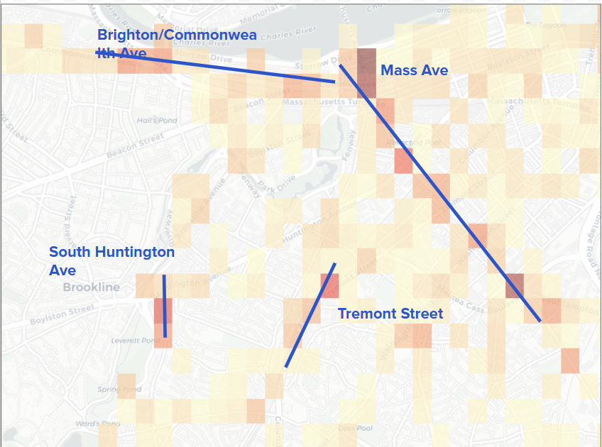

# Data Science Final Project

### By: Amanda Chang, Ben Meyer, Trinity Lee

```{r, include=FALSE}
library(tidyverse)
library(lubridate)
library(leaflet)
library(shiny)
library(leaflet)
library(dplyr)
library(readr)
library(lubridate)
library(glue)
library(janitor)
library(DT)            
library(ggmap)         
library(RColorBrewer) 
library(sf)            
library(gplots)       
library(choroplethr)  
library(choroplethrMaps)
library(maps)
library(ggthemes)
library(leaflet.extras)
library(htmlwidgets) # for amanda's legend
```

## Introduction

Bicycling is one of the most popular urban mobility alternatives to cars. Most cities often have bike programs to expand access to biking and develop infrastructure to ensure safety when biking. However, even with these improvements, accidents can occur, leading to questions on safety and the factors that can contribute to more bicycle accidents in the busy city. Over the decades, Boston has undertaken to expand its bike lane network to promote safer, more sustainable transportation, accompanied with large amounts of data collected by the government that are freely accessible to all. With such resources, we decided to investigate bike accidents that occurred within the Boston—specifically only in the Suffolk county limits of Boston city—to identify any general trends and also if there were any geographical hotspots and briefly investigate why it is a hotspot and if focusing bike safety improvements in these hotspots would be effective ways to improve bike safety in Boston.

```{r,include=FALSE}
#All Data Loading 

data <- read_csv("Bike_Crash_Data_Vision_Zero.csv")

bike <- data |>
  filter(mode_type == "bike") |>
  mutate(
    dispatch_ts = ymd_hms(dispatch_ts),
    date = as_date(dispatch_ts),
    year = year(dispatch_ts),
    month = month(date),
    season = case_when(
            month(date) %in% c(12, 1, 2) ~ "Winter",
            month(date) %in% c(3, 4, 5) ~ "Spring",
            month(date) %in% c(6, 7, 8) ~ "Summer",
            month(date) %in% c(9, 10, 11) ~ "Fall"
          ),
    hour = hour(dispatch_ts) )

#Blue Bikes Trip Summary
all_summary <- read.csv("all_trips_summary.csv")


#Blue Bikes Import Total Trip Count Per Start Station with Coordinations and Filter Out Stations Outside of Boston
total_counts <- read.csv("total_counts_with_coord.csv")
total_counts <- head(total_counts, -1) |>
  #only in boston
  filter((42.237210 < start_lat & start_lat < 42.400739) & 
         ( -71.186470 < start_lng & start_lng < -70.985085)) |>
  
  #cambridge
  filter(!(
    start_lat > 42.355417 & start_lat < 42.425723 &
    start_lng > -71.114138 & start_lng < -71.088989
  )) |>
  
  #somerville
  #42.374595, -71.168457
  #42.432250, -71.098786
  filter(!(
    start_lat > 42.374595 & start_lat < 42.432250 &
    start_lng > -71.168457 & start_lng < -71.098786
  )) |>

  #harvard
  # 42.370632, -71.124589
  # 42.377532, -71.115612
  filter(!(
    start_lat > 42.370632 & start_lat < 42.377532 &
    start_lng >  -71.124589 & start_lng < -71.115612
  )) |>

  #42.364358, -71.117201
  #42.371603, -71.113690
  filter(!(
    start_lat > 42.364358 & start_lat <42.371603 &
    start_lng > -71.117201 & start_lng < -71.113690
  )) |>
  
  #42.355546, -71.094754
  #42.380322, -71.079337
  filter(!(
    start_lat >42.355546 & start_lat < 42.380322 &
    start_lng > -71.094754 & start_lng <  -71.079337
  )) 

total_counts <- total_counts |>
  filter(!is.na(start_lat), !is.na(start_lng), !is.na(n))


#Amanda's section & bike lane data
boston_crashes_raw <- bike
bike_network <- st_read("existing_bike_network_2024.json") %>% 
  st_transform(4326) # Ensure WGS84 for Leaflet
head(bike_network)

bike_network_2022 <- st_read("existing_bike_network_2022.json") %>% 
  st_transform(4326) # Ensure WGS84 for Leaflet
head(bike_network_2022)
```

## General Insights and Visualizations.

For our first pass at bike accident investigations, we wanted to see if there were any overall trends, not purely geographical, that could contribute to higher accident rates. For this, we leveraged the accidents dataset provided by Vision Zero which collected bike accident data in Boston for the past decade. We decided to see if there were any trends for crash data based on time, as shown by the bar charts below.

```{r, echo=FALSE}

ggplot(bike, aes(x = year)) +
  geom_bar(fill="blue") +
  labs(
    title = "Bike Accidents Per Year",
    x = "Year",
    y = "Number of Crashes"
  ) +
  theme_minimal()

ggplot(bike, aes(x = hour)) +
  geom_histogram(binwidth=1, fill="blue") +
  facet_wrap(year ~.)+
  labs(
    title = "Distribution of Crash Times Per Year",
    x = "Hour of Day",
    y = "Number of Crashes"
  ) +
  theme_minimal()
```

The general visualizations on accidents show that bike accidents have steadily been decreasing each year, and that during a 24 hour period, for all years except during the pandemic there are often spikes in accidents during rush hour (8am-10am and 5pm-6pm) Overall, the data corroborated pre-existing assumptions on bike accidents like how rush hour is when there are the most accidents (probably due to the heightened volume of bike and car traffic in general). For Boston, the yearly bike accident trends showed no irregularities and in fact displayed a slow decrease in accidents over the past decade, even when we ignore the decrease due to the pandemic (2020-2022) when there were just less people going outside. This decrease could be attributed to Boston’s continual infrastructure work on bike safety that has occurred starting in 2018, as outlined on the Boston government's [website page](https://www.boston.gov/departments/transportation/safer-more-accessible-walking-and-biking) on bike infrastructure work which showcases all their projects to build more bike lines and more.

We can also look at the time based on the season, and the overall data is not surprising.

```{r, echo=FALSE}

ggplot(bike, aes(x = hour, fill=season)) +
  geom_histogram(binwidth=1) +
  facet_wrap(season ~.)+
  labs(
    title = "Distribution of Crash Times",
    x = "Hour of Day",
    y = "Number of Crashes"
  ) +
  theme_minimal()

```

There were less bike accidents during seasons like winter when there would also just be less bicyclists in general, and summer was peak accidents, which makes sense given it's also the season when people would be biking due to the amicable weather. To better see if these trends corresponded to general volume of bike traffic, we also utilized the Bluebikes dataset (Bluebikes are Boston’s street bike rental service) as a rough indicator of how many bicyclists traverse Boston each day for the past decade. While we acknowledge that Bluebikes trip data does not accurately reflect bike data and may skew to more casual bicyclists compared to more serious bicyclists who personally own their bikes, it is a solid reference point to use for bike traffic given there are no public datasets tracking bicyclist traffic One additional thing to note about the Bluebikes data is during data processing, it was found that 2023 several months of data were invalid (NAs) and could not be used. Given the number of invalid months was larger than valid months, we stripped 2023 data from the dataset.

When overlaying the graphs, we can see that bicycle accidents in Boston have steadily been decreasing while the number of bike trips via Bluebikes have increased. While Bluebike trip increases causation may be due to station expansions as adoption increases, it’s important to note that it still does show that there are more and more bikes being used Boston each year.

```{r, echo=FALSE}

df_year <- all_summary |>
  group_by(year) |>
  summarise(
    total_trips = sum(total_trips),
    total_accidents = sum(total_accidents),
    .groups = "drop"
  )

scale_factor <- max(df_year$total_trips) / max(df_year$total_accidents)

ggplot(df_year, aes(x = year)) +
  geom_col(aes(y = total_trips / 1000, fill = "Trips (per thousand)"), alpha = 0.6) +
  geom_line(aes(y = total_accidents * scale_factor / 1000,
                group = 1,
                color = "Accidents"),
            linewidth = 1.2) +
  geom_point(aes(y = total_accidents * scale_factor / 1000,
                 color = "Accidents"),
             size = 2) +
  scale_fill_manual(values = c("Trips (per thousand)" = "steelblue")) +
  scale_color_manual(values = c("Accidents" = "red")) +
  scale_y_continuous(
    name = "Trips (thousands)",
    sec.axis = sec_axis(~ . * 1000 / scale_factor, name = "Accidents")
  ) +
  labs(
    title = "Total Annual Bike Trips vs Bike Accidents (Yearly, Dual Axis)",
    x = "Year",
    fill = "",
    color = ""
  ) +
  theme_minimal()

```

We also overlaid geographically the bicycle accidents on the map and each blue bikes station on the map (sized and colored based on volume of trips taken from the station) to see if there were any interesting trends, which we did not find any.

```{r, echo=FALSE}
bike <- bike |>
  filter(!is.na(lat), !is.na(long))

pal <- colorNumeric(
  palette = "YlOrRd",
  domain = total_counts$n
)

#Station Data
leaflet()|>
  addTiles() |>
  addCircles(
    data = total_counts,
    lat = ~start_lat,
    lng = ~start_lng,
    radius = ~sqrt(n)/3, #Stations with More Trips Are darler & have larger radius
    fillColor = ~pal(n),
    stroke= FALSE,
    fillOpacity = 0.5,   # lower = more blending
  ) |>
  
  #Accident Data
    addCircleMarkers(
    data = bike,
    lat = ~lat,
    lng = ~long,
    radius = 2,
    color = "blue",
    stroke= FALSE,
    fillOpacity = 0.7,
  ) |>
  addProviderTiles(providers$CartoDB.Positron) |>

  addLegend(
    position = "bottomright",
    pal = pal,
    values = total_counts$n,
    title = "Number of Blue Bike Trips Per Station",
    opacity = 0.8
  )


```

One curiosity was whether time affected the geographic location of accidents. Unfortunately, the base data did not indicate there was a strong trend between time and geographic accidents. Below is a map that that plots the bike accidents that occurred during the last decade in Boston, and from a first glance the accidents seem to be random geographically.

```{r, echo=FALSE}
ui <- fluidPage(
  titlePanel("Bike Crashes by Time of Day"),
  
  sidebarLayout(sidebarPanel(sliderInput(
        "time",
        "Show crashes at hours:",
        min = 0,
        max = 24,
        value = 12,
        step = 1
      )),
    mainPanel(
      leafletOutput("map")
    )))

server <- function(input, output, session) {
  filtered_data <- reactive({
    bike |>
      filter(hour == input$time)
  })
  
  # Base map
  output$map <- renderLeaflet({
    leaflet(bike) |>
    addProviderTiles(providers$CartoDB.Positron) |>
      setView(lng = mean(bike$long, na.rm = TRUE),
              lat = mean(bike$lat, na.rm = TRUE),
              zoom = 12)
  })
  
  # Update points when slider moves
  observe({
    leafletProxy("map", data = filtered_data()) |>
      clearMarkers() |>
      addCircleMarkers(
        lng = ~long,
        lat = ~lat,
        color = "blue",
        radius = 4,
        stroke = FALSE,
        fillOpacity = 0.7,
        popup = ~paste(
          "Year:", year, "<br>",
          "Mode:", mode_type, "<br>",
          "Street:", street, "<br>",
          "Time:", dispatch_ts
        ))})
}
shinyApp(ui, server)
```

## Geographic Investigations

Once confirming that the general accident data held no noticeable irregularities in terms of time, we shifted our focus into identifying any geographic trends with the accidents. Given several statistics reported by [others](<https://www.cdc.gov/pedestrian-bike-safety/about/bicycle-safety.html>) indicated higher chances of accidents/death for bicyclists at intersections, we used the Vision Zero dataset to see the different categorizations of accidents and where they occurred (street, intersection, etc)

Bar charts of Accidents

```{r, echo=FALSE}


ggplot(bike, aes(x = location_type, fill = location_type)) +
  geom_bar() +
  facet_wrap(year ~.)+
  labs(
    title = "Bike Accidents Per Location Type",
    x = "Location Type",
    y = "Number of Crashes"
  ) +
  theme_minimal()
```

```{r, echo=FALSE}
table(bike$location_type)

all_crashes <- ggplot(bike, aes(x=year)) +
  geom_bar(fill="black") +
  labs(x="Year", y="Number of Crashes")

faceted_crashes <- ggplot(bike, aes(x=year)) +
  geom_bar(aes(fill=location_type)) +
  labs(x="Year", y="Number of Crashes") +
  facet_grid(rows=vars(location_type))

crash_year_plots <- all_crashes | faceted_crashes
crash_year_plots + plot_annotation(title="Number of Bike Crashes per Year")
```

We investigated where each accident occurred, specifically if it was at an intersection or a street, with a catch all “other” category for the rest. We found that for the past decade the cumulative number of intersections and street accidents are almost the same, superficially disproving the idea that most accidents occur at intersections. If we do a year by year breakdown we can actually see that some years there are more intersection accidents than street bike accidents but there is no definitive trend we can identify. While this high level analysis confirms that intersections and streets have the same amount of risk levels for bike accidents, we will explore in more depth the geographical correlations and will see that certain intersections can be accidents hotspots.

While plotting individual accidents can be useful, a more simplified view can give us better insights into whether there are any significant trends. One such way is to utilize a heatmap.To make the visualization even more simplified, a gridded heatmap of the accidents was made to clearly showcase areas of high accidents. Using leaflet, we also were able to make it interactive to give information on the total number of accidents in that geographic grid, number of trips made from the stations in the grid, and the accidents-to-trips ratio. We made two separate grid views as well.

```{r, echo=FALSE}
cell_size <- 0.002 #Grid Cell Size  

acc_grid <- bike |>
  mutate(
    lat_bin = floor(lat / cell_size) * cell_size,
    lng_bin = floor(long / cell_size) * cell_size
  )

bike_grid <- total_counts |>
  mutate(
    lat_bin = floor(start_lat / cell_size) * cell_size,
    lng_bin = floor(start_lng / cell_size) * cell_size
  )

# Count accidents per grid cell
acc_counts <- acc_grid |>
  group_by(lat_bin, lng_bin) |>
  summarize(bike = n(), .groups = "drop")

# Count Bike Trips Per Grid
bike_counts <- bike_grid |>
  group_by(lat_bin, lng_bin) |>
  summarize(trips = sum(n), .groups = "drop")  # ← Changed from n() to sum()

grid_data <- full_join(acc_counts, bike_counts,
                       by = c("lat_bin", "lng_bin")) |>
  mutate(
    bike = ifelse(is.na(bike), 0, bike),
    trips = ifelse(is.na(trips), 0, trips),
    rate = ifelse(trips == 0, 0, bike / trips)
  )

#Take out squares with only 1 accident
grid_data <- grid_data |>
  filter(bike > 1)


# No cap — full range
pal <- colorNumeric(
  palette = c("#fff7bc", "red", "#7f0000"),
  domain = grid_data$bike,
  na.color = "transparent"
)

leaflet(grid_data) |>
  addTiles() |>
  addRectangles(
    lng1 = ~lng_bin,
    lat1 = ~lat_bin,
    lng2 = ~lng_bin + cell_size,
    lat2 = ~lat_bin + cell_size,
    fillColor = ~pal(bike),  
    fillOpacity = 0.7,
    color = NA,
    popup = ~paste0(
      "Accidents: ", bike, "<br>",
      "Trips: ", trips, "<br>",
      "Accidents to Trip Ratio: ", round(rate * 100, 2), "%"
    )
  ) |>
      addProviderTiles(providers$CartoDB.Positron) |>

  addLegend(
    pal = pal,
    values = ~bike,
    opacity = 0.7,
    title = "Accidents Count"
  )

```

The first is a standard grid view of accidents per geographic grid. We can see visually that Mass Ave and Brighton/Commonwealth Ave have consistent streams of accidents along the road and intersections on it. This makes sense since these are areas with high traffic, thus accidents would probably occur here. However, areas like South Huntington Avenue and Tremont street also had noticeably high numbers of accidents in the past decade compared to other streets, something we did not expect.



Now, given that this view does not take into account the sheer volume of trips taken in busy areas for the number of bike accidents, we made a visualization where we normalized each grid based on the accidents-to-trips ratio—simply taking the total number of accidents in the geographic area and then dividing it by the number of blue bike trips started in the geographic grid—to estimate how the map would look like normalized. This figure showcases areas where the percentage of accidents in relation to trips are higher than the number of trips started there. Unlike our first grid heatmap, we can see that this visualization highlights different locations, and high accident prone areas, like Mass Ave, do not stick out because their accident percentage is almost 0% of all trips taken there. Using this view, we can see that random spots in Back Bay, Boylston, and near Tufts Medical center have 1% of all trips started there were accidents.

```{r, echo=FALSE}
pal <- colorNumeric(
  palette = c("#fff7bc", "red", "#7f0000"),
  domain = grid_data$rate,
  na.color = "transparent"
)

leaflet(grid_data)|>
  addTiles() |>
  addRectangles(
    lng1 = ~lng_bin,
    lat1 = ~lat_bin,
    lng2 = ~lng_bin + cell_size,
    lat2 = ~lat_bin + cell_size,
    fillColor = ~pal(rate),
    fillOpacity = 0.7,
    color = NA,
    popup = ~paste0(
      "Accidents: ", bike, "<br>",
      "Trips: ", trips, "<br>",
      "Accidents to Trip Ratio: " ,round(rate * 100, 2), "%"
    )
  ) |>
      addProviderTiles(providers$CartoDB.Positron) |>

   addLegend(
    pal = pal,
    values = ~rate,  
    labFormat = labelFormat(suffix = "%", transform = function(x) x * 100),
    title = "Accidents to Total Trips Ratio"
  )
```

However, given that we only can use the data from trips started in particular stations, it’s only a rough estimate to how busy each geographic square is, and this visualization needs to be looked in the context of the other visualizations to guide our understanding and investigations. Furthermore, A grid cell on South Huntington Avenue has a higher accident rate than normal, which is interesting given that we also know South Huntington Avenue has higher than normal accidents in general.

Overall, these visualizations can give the viewer a clear idea as to the sheer volume of accidents as well as the scale of accidents per location given traffic size.

## Datasets

In most cities, like the city of Boston, bike infrastructure is not consistent, with different types of bike lane categorizations. For the city of Boston, there was a [dataset](https://experience.arcgis.com/experience/925eb7fd89c24c5f9c07bcc20ee9ea74/) which mapped out the different bike lanes. After analyzing the different types of bike lanes, we drew up a scale based on the qualitative danger level of each type of lane for bicyclists, measured by vehicle exposure. For example, a shared bike lane with vehicles (no clear demarcation of what is a bike lane versus car lane) would probably pose higher danger levels to bicyclists for crashes with other vehicles given the vicinity of cars compared to a clear and separate bike lane. 

```{r, echo=FALSE}
# sorted from most dangerous (top of legend) to safest (bottom of legend)
safety_order <- c(
  "SLM",        # Shared Lane Markings (Zero protection, full mixing)
  "BL-PEAKBUS", # Bike Lane/Peak Hour Bus Lane (High-speed heavy vehicle mixing)
  "CFBS",       # Contraflow Bike Lane (typo found in the database)
  "BLSL",       # Bike Lane/Shared Lane Hybrid (Inconsistent protection)
  "SBLSL",      # Separated Bike Lane/Shared Lane Hybrid (Gaps in protection)
  "SLMTC",      # Traffic-Calmed Local Street with Shared Lane Markings
  "CFBL",       # Contraflow Bike Lane (Painted-only, high conflict risk)
  "BL",         # Bike Lane (Standard painted lane, door-zone risk)
  "BFBL",       # Buffered Bike Lane (Paint buffer, but no physical barrier)
  "SBLBL",      # Separated Bike Lane/Bike Lane Hybrid
  "SBL",        # Separated Bike Lane (Standard flex-post or curb)
  "CFSBL",      # Contraflow Separated Bike Lane (High protection)
  "SUPN",       # Shared Use Path - Natural Surface (Safe from cars, but slip risk)
  "SUPM",       # Shared Use Path - Minor
  "SUP",        # Shared Use Path (Fully off-street)
  "WALK",       # Walkway
  "PED"         # Pedestrian Zone (Lowest vehicle interaction)
)

bike_labels <- data.frame(
  Abbr = safety_order,
  infra_full_name = c(
    "Shared Lane Markings",
    "Bike Lane/Peak Hour Bus Lane",
    "Contraflow Bike Lane",
    "Bike Lane Side + Shared Lane Side",
    "Separated Bike Lane Side + Shared Lane Side",
    "Traffic-Calmed Local Street",
    "Contraflow Bike Lane",
    "Standard Bike Lane",
    "Buffered Bike Lane",
    "Separated/Standard Hybrid",
    "Separated Bike Lane",
    "Contraflow Separated Bike Lane",
    "Shared Use Path (Natural)",
    "Shared Use Path (Minor)",
    "Shared Use Path (Paved)",
    "Walkway",
    "Pedestrianized Street"
  )
)

exposure_list <- data.frame(safety_order)
exposure_list$exposure_metric <- 1:nrow(exposure_list)
```

```{r, echo=FALSE}
bike_crashes <- boston_crashes_raw %>%
   filter(mode_type == "bike") %>%
   drop_na(lat, long) %>%
   st_as_sf(coords = c("long", "lat"), crs = 4326)

roads_projected <- st_transform(bike_network, 2249)
crashes_projected <- st_transform(bike_crashes, 2249)

nearest_indices <- st_nearest_feature(crashes_projected, roads_projected)
nearest_distances <- st_distance(
  crashes_projected,
  roads_projected[nearest_indices, ],
  by_element = TRUE
)

# if its within 15 meters then keep it
threshold_m  <- 15

assigned_indices <- ifelse(
  as.numeric(nearest_distances) <= threshold_m,
  nearest_indices,
  NA  # dont assign roads too far from the road
)

road_counts <- table(assigned_indices[!is.na(assigned_indices)])

bike_network$crash_count <- 0
bike_network$crash_count[as.numeric(names(road_counts))] <- as.numeric(road_counts)
bike_network$ExisFacil <- factor(bike_network$ExisFacil, levels = safety_order, ordered=TRUE)
bike_network <- bike_network %>%
  left_join(bike_labels, by = c("ExisFacil" = "Abbr"))


danger_colors <- colorRampPalette(c("#e41a1c", "#9B8FFF", "#00A719"))(length(safety_order))
names(danger_colors) <- safety_order

pal <- colorFactor(
  palette = danger_colors,
  levels = safety_order,
  domain = bike_network$ExisFacil
)


leaflet() %>%
   addProviderTiles(providers$CartoDB.Positron) %>%

   addPolylines(
      data = bike_network,
      color = ~pal(ExisFacil),
      weight = 3,
      opacity = 1,
      label = ~paste0("Street: ", STREET_NAM, " | Crashes: ", crash_count," | Infra: ", infra_full_name),
      group = "Infrastructure"
   ) %>%
  
  addHeatmap(
    data = bike_crashes,
    lng = ~st_coordinates(bike_crashes)[,1],
    lat = ~st_coordinates(bike_crashes)[,2],
    gradient = c(
    '0.4' = 'darkblue',
    '0.6' = 'blue',
    '0.7' = 'yellow', 
    '0.8' = 'orange', 
    '1.0' = 'red'
    ),
    blur = 15,
    max = 0.11,
    radius = 11,
    group = "Crash Hotspots"
  ) %>%
  
  addControl(
  html = "<div id='infra-legend' style='background: rgba(255, 255, 255, 0.5); 
                      padding: 10px; 
                      border: 3px solid rgba(0,0,0,0.2); 
                      border-radius: 4px; 
                      text-align: center;
                      font-family: sans-serif;'>
            
            <b style='display: block; margin-bottom: 8px; font-size: 12px;'>Vehicle Exposure</b>
            
            <div style='font-size: 10px; font-weight: bold; color: #e41a1c; margin-bottom: 2px;'>MOST</div>
            
            <div style='height: 120px; 
                        width: 18px; 
                        background: linear-gradient(to bottom, #e41a1c 0%, #6250FF 50%, #00A719 100%); 
                        margin: 2px auto;
                        border-radius: 2px;'>
            </div>
            
            <div style='font-size: 10px; font-weight: bold; color: #00A719; margin-top: 2px;'>LEAST</div>
            
          </div>",
  position = "bottomright"
  ) %>% 

  addLayersControl(
    overlayGroups = c("Infrastructure", "Crash Hotspots"),
    options = layersControlOptions(collapsed = FALSE)
  ) %>%
  
  onRender("
    function(el, x) {
      var map = this;
      var legend = document.getElementById('infra-legend');
      
      map.on('overlayadd', function(e) {
        if (e.name === 'Infrastructure') {
          legend.style.display = 'block';
        }
      });
      
      map.on('overlayremove', function(e) {
        if (e.name === 'Infrastructure') {
          legend.style.display = 'none';
        }
      });
    }
  ")
```

Here we have the raw number of crashes for all roads with greater than 20 bicycle accidents in Boston:
```{r, echo=FALSE}
dangerous_roads_stats <- bike_network %>%
  as_tibble() %>% 
  group_by(STREET_NAM) %>%
  summarize(total_crashes = sum(crash_count, na.rm = TRUE)) %>%
  filter(total_crashes > 20) %>% 
  arrange(desc(total_crashes))

ggplot(dangerous_roads_stats, aes(x = reorder(STREET_NAM, total_crashes), y = total_crashes)) +
  geom_col(fill = "#b90e0a") +
  coord_flip() +
  labs(
    title = "Total Bike Crashes Ranked by Road",
    subtitle = "Roads with over 20 crashes",
    x = "Street Name",
    y = "Number of Crashes"
  )

```

This reveals to us that the most crashed-on routes are Mass Ave, Commonwealth, and Washington Street, likely owing in large part to their busyness and the number of cars that share these main thoroughfares with the bicycles. It is worth noting that this list only includes roads which already have some amount of bicycle infrastructure, so each of these roads has, at minimum, shared lane markings.

However, in an effort to normalize the accident data by the number of cyclists who are actually using that road to quantifiably determine the most accident-prone routes, rather than just the raw number of accidents occurring on that route, we then divided the number of accidents by the total number of cyclists recorded on that road, [as provided by Boston Magazine](https://www.bostonmagazine.com/news/2017/03/01/boston-bike-traffic-data/#:~:text=Massachusetts%20Ave%20Columbus%20Avenue%20%E2%80%94%20797%20bicyclists). This report records the number of cyclists recorded at the top ten busiest cycling roads during a particular 24 hour period in September 2016. The top ten Boston roads with the most cyclists are:

1. Massachusetts Ave. Bridge, south of Back Street — 3,081 bicyclists

2. BU Bridge, north of Commonwealth Avenue — 1,957 bicyclists

3. Commonwealth Avenue, west of Silber Way — 1,571 bicyclists

4. Southwest Corridor Bicycle Path, south of Heath Street — 1,554 bicyclists

5. Longwood Avenue, east of Pilgrim Road — 1,348 bicyclists

6. North Harvard Street, south of Soldiers Field Road — 1,320 bicyclists

7. Columbus Avenue, west of Massachusetts Avenue — 1,314 bicyclists

8. Brighton Avenue, east of St. Lukes Road — 1,063 bicyclists

9. Columbus Avenue, west of Holyoke Street — 825 bicyclists

10. Massachusetts Avenue, south of Columbus Avenue — 797 bicyclists

```{r, echo=FALSE}
busy_street_names <- c(
  "Massachusetts Avenue", "Commonwealth Avenue", "Columbus Avenue", 
  "Brighton Avenue", "North Harvard Street", "Longwood Avenue", 
  "Boston University Bridge", "Southwest Corridor"
)
busy_road_stats <- bike_network %>%
  as_tibble() %>% 
  filter(STREET_NAM %in% busy_street_names) %>%
  group_by(STREET_NAM) %>%
  summarize(total_crashes = sum(crash_count, na.rm = TRUE)) %>%
  arrange(desc(total_crashes))

ggplot(busy_road_stats, aes(x = reorder(STREET_NAM, total_crashes), y = total_crashes)) +
  geom_col(fill = "#b90e0a") +
  coord_flip() +
  labs(
    title = "Total Bike Crashes on Boston's Busiest Cycling Roads",
    subtitle = "Based on Vision Zero Crash Data and Boston Magazine's Top 10 List",
    x = "Street Name",
    y = "Number of Crashes"
  ) +
  theme_minimal()
```

The above is the same data as in the same plot but selected down for direct comparison with the following plot, as bicycle traffic data is not easily obtained for every road in Boston.

```{r, echo=FALSE}
traffic_counts <- tibble(
  STREET_NAM = c("Massachusetts Avenue", "Boston University Bridge", "Commonwealth Avenue", 
                 "Southwest Corridor", "Longwood Avenue", "North Harvard Street", 
                 "Columbus Avenue", "Brighton Avenue"),
  daily_bikers = c(3878, 1957, 1571, 1554, 1348, 1320, 2139, 1063)
)

normalized_stats <- bike_network %>%
  as_tibble() %>%
  filter(STREET_NAM %in% traffic_counts$STREET_NAM) %>%
  group_by(STREET_NAM, ExisFacil) %>%
  summarize(total_crashes = sum(crash_count, na.rm = TRUE), .groups = "drop") %>%
  left_join(traffic_counts, by = "STREET_NAM") %>%
  mutate(crash_rate = (total_crashes / daily_bikers) * 100)

ggplot(normalized_stats, aes(x = reorder(STREET_NAM, crash_rate, sum), 
                             y = crash_rate)) +
  geom_col(fill = "#b90e0a") +
  coord_flip() +
  scale_fill_viridis_d() +
  labs(
    title = "Bike Crash Rate on Boston's Busiest Cycling Roads",
    subtitle = "Normalized: (Total Crashes / Daily Bicyclists) * 100",
    x = "Street Name",
    y = "Total Crashes Recorded / Daily Riders"
  ) +
  theme_minimal()
  # theme(
  #   legend.position = "bottom",
  #   legend.justification = "left",
  #   legend.box.just = "left",
  #   legend.text = element_text(size = 8),
  #   legend.title = element_text(face = "bold", size = 9)
  # )
```

Once we normalize for the number of cyclists, based on the Boston Magazine data collected in 2017, it reveals that although the de facto number of crashes is greater for Massachusetts Avenue than Commonwealth, the actual likelihood of crashing is much higher per cyclist for Commonwealth!

What this reveals to us is that the roads with the most room for growth in bicycle safety and the most direct impact on the number of crashes are Commonwealth Avenue, Massachusetts Avenue, and potentially Washington Street (see the first comparison of routes), although we do not have un-normalized figures for that particular street.

We also overlaid our grid heatmap of accidents with our streetview, and we noticed immediately that certain areas had higher concentration of accidents. The grid view heatmap allowed us to see a lot more easily where accidents were concentrated, and we could now see certain intersections were exceptionally high in terms of accidents.

```{r, echo=FALSE}
bike_crashes <- boston_crashes_raw %>%
  filter(mode_type == "bike") %>%
  drop_na(lat, long) %>%
  st_as_sf(coords = c("long", "lat"), crs = 4326)

roads_projected <- st_transform(bike_network, 2249)
crashes_projected <- st_transform(bike_crashes, 2249)

nearest_road_indices <- st_nearest_feature(crashes_projected, roads_projected)

road_counts <- table(nearest_road_indices)
bike_network$crash_count <- 0
bike_network$crash_count[as.numeric(names(road_counts))] <- as.numeric(road_counts)

# sorted from most dangerous (top of legend) to safest (bottom of legend)
safety_order <- c(
  "SLM",        # Shared Lane Markings (Zero protection, full mixing)
  "BL-PEAKBUS", # Bike Lane/Peak Hour Bus Lane (High-speed heavy vehicle mixing)
  "CFBS",       # Contraflow Bike Street (Shared space with opposing traffic)
  "BLSL",       # Bike Lane/Shared Lane Hybrid (Inconsistent protection)
  "SBLSL",      # Separated Bike Lane/Shared Lane Hybrid (Gaps in protection)
  "SLMTC",      # Traffic-Calmed Local Street with Shared Lane Markings
  "CFBL",       # Contraflow Bike Lane (Painted-only, high conflict risk)
  "BL",         # Bike Lane (Standard painted lane, door-zone risk)
  "BFBL",       # Buffered Bike Lane (Paint buffer, but no physical barrier)
  "SBLBL",      # Separated Bike Lane/Bike Lane Hybrid
  "SBL",        # Separated Bike Lane (Standard flex-post or curb)
  "CFSBL",      # Contraflow Separated Bike Lane (High protection)
  "SUPN",       # Shared Use Path - Natural Surface (Safe from cars, but slip risk)
  "SUPM",       # Shared Use Path - Minor
  "SUP",        # Shared Use Path (Fully off-street)
  "WALK",       # Walkway
  "PED"         # Pedestrian Zone (Lowest vehicle interaction)
)

bike_network$ExisFacil <- factor(bike_network$ExisFacil, levels = safety_order)

```

```{r, echo=FALSE}

#### Visualizations ###################
pal1 <- colorFactor(
  palette = c("#e41a1c", "#6250FF", "#00A719"),
  domain = bike_network$ExisFacil
)

# No cap — full range
pal2 <- colorNumeric(
  palette = c("#fff7bc", "red", "#7f0000"),
  domain = grid_data$bike,
  na.color = "transparent"
)
leaflet() %>%
    addRectangles(
    data = grid_data,
    lng1 = ~lng_bin,
    lat1 = ~lat_bin,
    lng2 = ~lng_bin + cell_size,
    lat2 = ~lat_bin + cell_size,
    fillColor = ~pal2(bike),
    fillOpacity = 0.7,
    color = NA,
    group = "Crash Hotspots Ratio",
    popup = ~paste0(
      "Accidents: ", bike, "<br>",
      "Trips: ", trips, "<br>",
      "Accidents to Trip Ratio: ", round(rate * 100, 2), "%"
    )
  ) %>%
  
  addProviderTiles(providers$CartoDB.Positron) %>%
  addPolylines(
    data = bike_network,
    color = ~pal1(ExisFacil),
    weight = 3,
    opacity = 1,
    label = ~paste0("Street: ", STREET_NAM, " | Crashes: ", crash_count),
    group = "Infrastructure"
  ) %>%

  
  addLayersControl(
    overlayGroups = c("Infrastructure", "Crash Hotspots Ratio"),
    options = layersControlOptions(collapsed = FALSE)
  ) %>%
  
  addLegend(
    pal = pal1,
    values = bike_network$ExisFacil,
    title = "Road Category",
    position = "bottomright"
  )

```

One thing that immediately stuck out was that some intersections were accident hotspots. For example, the intersection between Mass Ave and Albany street contained 37 accidents, and the grid view showed us that in this particular area this intersection was a blend of Shared Lane Markings (SLM) and Buffered Bike Lanes (BFBL).


In fact, a lot of the accident prone grid cells often were at an intersection that was a blend of buffered bike lanes and shared lane markings. For example Mass Ave, which had the highest number of accidents along it, had higher concentrations on the intersections with SLMs mixed into it.  Below are a list of intersections that were particularly high in terms of accident count and had a mix of SLM and BFBLs on Mass Ave. 

Perusing the rest of the map, we can see that there are definitely grid cells that are on intersections that have higher accident counts than their nearby grid cells.This could reinforce the idea that more accidents are likely to occur at intersections given several hotspots for accidents occurring at intersections. While the sheer number of accidents over the decade have shown that accidents at intersections and streets are equal, specific intersections can become hotspots for accidents. This makes sense given that intersections are complex areas in which many cars can go in different directions at once, which can lead to confusion and bike accidents. In intersections with high traffic and the added complexity of bike lanes having separate lanes and clear demarcations blending into a shared lane marking (SLM) could add to the confusion, leading to the intersection becoming a hotspot for accidents. 

The confusion attributed by bike lanes suddenly disappearing that could potentially cause accidents is not only applicable to intersections. We can also see that there are parts of the map where accidents spike up compared to its nearby grid cells, with an SLM in the vicinity. A strip of road along Dorchester Ave has a spike in accidents right in the spot where the road switches from Bike Lane (BL) to a SLM (and based on the map also contains a multi road intersection).


Other instances of this can be seen on Columbia Road, Brighton Avenue, and more, where the sudden shift from a bike lane to an SLM leads to a spike in accidents. We could speculate that the spike in accidents is caused by a number of factors, including the confusion attributed to a sudden lack of bike infrastructure. It is important to note that we cannot fully isolate whether the switch is the problem or not. For exmaple,, a street only with SLMs, like Washington Street, actually has a fairly low number of accidents (although they do have some accidents). 


While this could be used to support the idea that higher accidents are strongly attributed to the confusion of bike infrastructure changing, the low number of accidents could also be because there were no bike lanes on Washington Street the first place, so bicyclists could have just avoided using Washington Street and opted to use a street with more bike infrastructure. All we can conclude from these visuals is that there seems to be a correlation between intersections and accidents, as well as bike lane switches to a SLM and accidents. 
