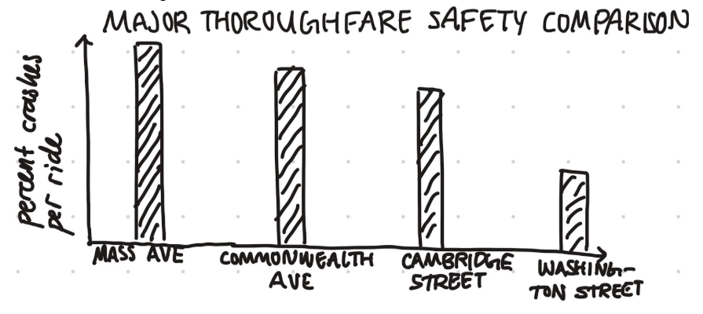
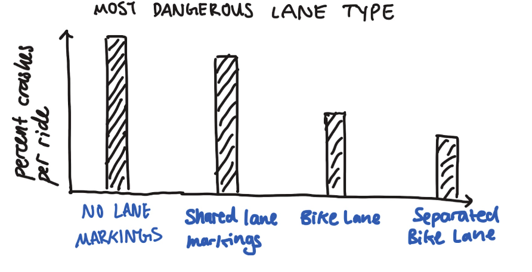
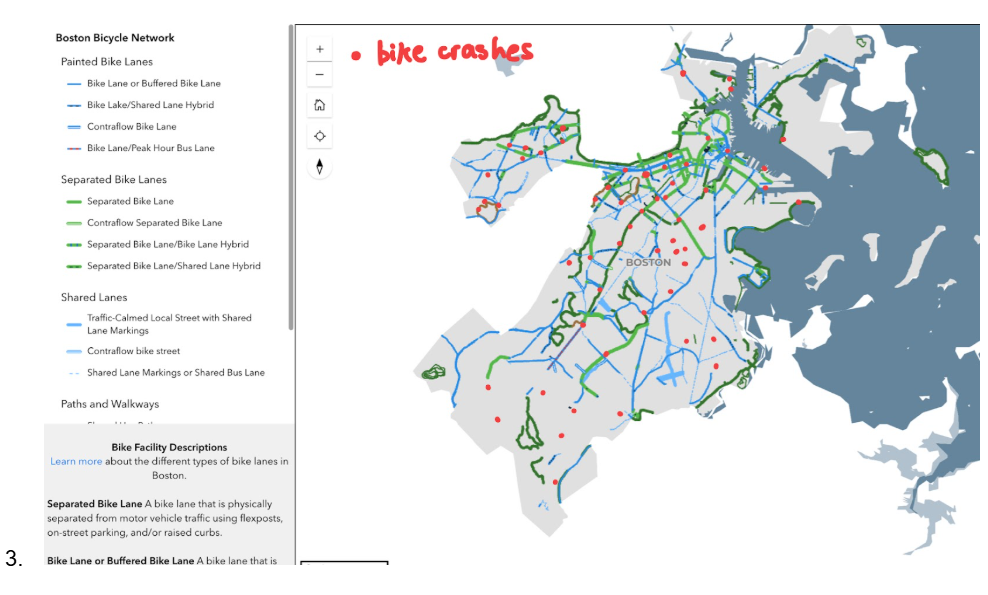
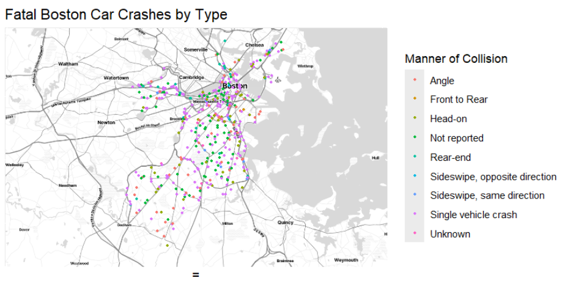
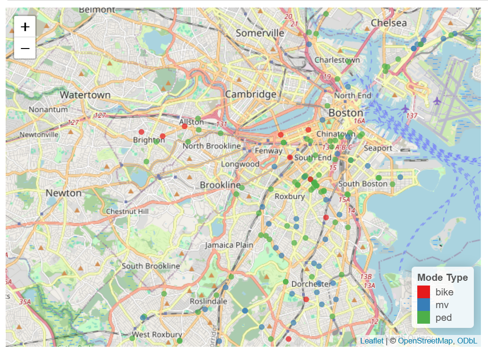
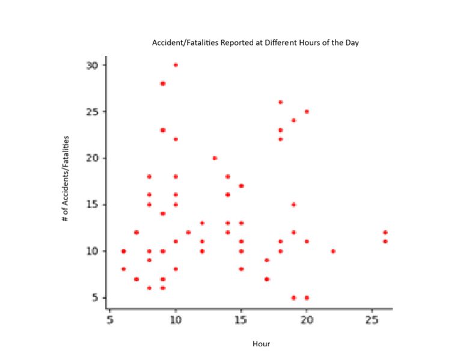

Each group should hand in one html document for the following exercises. Throughout the exercises, keep in mind that your research topics, questions, and data might evolve throughout the course of the project. This checkpoint is simply a first step in narrowing these down.

\

# Names & Workflow

List all group members. Discuss a plan for completing this assignment. How will you put together your shared Rmd? How will you divide the work? When will you meet to work on the assignment? Write this down in your Rmd.

Also, if you are using one, write down your GitHub repository.

Team Members: Amanda Chang, Trinity Lee, Ben Meyer

Github Repo: <https://github.com/tlee10333/Data-Sci-Final>

For work division, we're probably going to split the data identification and visualization generation equally. For the synthesis/writeup portion of the project, Amanda can take the lead but we'll all help out.

Currently, we can meet on Wednesdays.\

# Topic & Research Questions

Following on the conversations you've already had in the preliminary brainstorming exercises, identify a common research topic of interest.

Specify two to three potential research questions that (1) are related to the topic above; and (2) you can (at least partially) answer using data.

1.  **Bike data in Boston**: Are there any geographical correlations between bike path types and accidents, and what are the most dangerous paths in Boston?

2.  **Bikes vs Cars:** Is there a correlation between locations of bike and car accidents in Boston, and is one method of transportation necessarily safer than the other?

How are your research questions connected to sustainability? What are your personal learning goals related to sustainability for this project? You may wish to refer back to the [UN Sustainable Development Goals](https://sdgs.un.org/goals), the [Inner Development Goals](https://innerdevelopmentgoals.org/), and the [Engineering for One Planet](https://engineeringforoneplanet.org/wp-content/uploads/EOP_Framework_2023.pdf?), [Six Pillars of Climate Justice](https://centerclimatejustice.universityofcalifornia.edu/what-is-climate-justice/), and [Just Transition Principles](https://climatejusticealliance.org/just-transition/) frameworks. As a team, what sustainability background, analysis, and storytellling do you want to include in the scope of your project and in your final artifacts?

\
Our research questions relate to better and sustainable urban design to see where more environmentally friendly transit options (i.e. bikes) are the most beneficial for users. Our personal learning goals for this project are to better understand better urban design that creates a safe space for alternatives to vehicles.

# Data

Identify the data sets you will use to explore the research questions above. These data sets may already be in csv form, you may acquire them (e.g., scraped with rvest, via public API, or from an SQL database), or you may plan on collecting some extra data. For each data set, summarize the following:

-   data source
-   data description - what's being measured?
-   data limitations (eg: are the data recent? do they contain all variables you might want?)
-   data dimensions - how much data do you have?
-   how might the data be joined with other data you have?

Data limitations involve difficulty in joining the data as the street and other labelling from different datasets vary. Date windows seem to be pretty consistent and while there's a lot of data (i.e. the blue bikes data) there's not as much bike fatality/accident data so this might be a very doable question with the dataset presented.

Data Sources:

Also Ask cyvl for a dataset

**Blue Bikes:**

-   Blue Bikes General Data Page: <https://bluebikes.com/system-data>

-   Kaggle Blue Bikes Dataset <https://www.kaggle.com/datasets/akemail/blue-bike-boston-ma-bike-sharing-dataset> 

-   2024 Bike Network with Categorizations: <https://bostonopendata-boston.opendata.arcgis.com/datasets/existing-bike-network-2024/about> 

-   OR <https://data.boston.gov/dataset/existing-bike-network-2024> 

**Official MassDot Data for Bike Inventory (includes bike paths):** 

-   [**https://geodot.mass.gov/datasets/MassDOT::bike-inventory-current/explore?location=42.318419%2C-71.112910%2C12**](https://geodot.mass.gov/datasets/MassDOT::bike-inventory-current/explore?location=42.318419%2C-71.112910%2C12)

**Bicycle Crash Data by Location Boston:**

-   Vision Zero Fatality Records <https://experience.arcgis.com/experience/bae68e65908f45e1bcc86fe5f089d266/page/> 

**MassDOT Car Crash Data 2002-2026**

-   <https://apps.crashdata.dot.mass.gov/cdp/home> (requires email)

\

# Research Question 1

Restate research question 1. Construct 3-4 relevant visualizations that provide insight on / help answer this question and piece these together to tell a short story. For each visualization, 1-2 sentences will suffice.

**Bike data in Boston**: Are there any geographical correlations between bike path types and accidents, and what are the most dangerous paths in Boston?

This visualization helps highlight the most dangerous major roads in Boston by the percentage of crashes there are normalized by the number of riders who use that road. This would include 10 major roads in boston (although only 4 are illustrated here). The  purpose of this plot is to help focus policymakers’ attention towards the highest reward infrastructural changes.

A most dangerous lane type visualization would help quantify the effectiveness of different types of existing bicycle infrastructure, also normalized by the busyness of a particular road for cyclists.

A map-based visualization of different lane types and the positions of bike crashes will help us see where crashes happen most often and their relative position to different lane types. This plot may evolve beyond simple points (as illustrated below) into a heat map overlaid on lane types to help differentiate dot concentrations.

# Research Question 2 (and possibly 3)

Repeat the previous exercise for your second and possibly third research questions.

1.  **Bikes vs Cars: I**s there a correlation between locations of bike and car accidents in Boston, and is one method of transportation necessarily safer than the other?

This is a map of all recorded fatal car crashes in Boston between 1/1/2002 and 3/26/2026, separated by type as specified by MassDOT IMPACT car crash data. It shows a variety of different car crashes, including a large number of single-vehicle crashes.

\
Another relevant visualization is this, which just plots all the fatalities that have occurred by Vision Zero that tells us if the fatality involved a moving vehicle (mv), bike, or pedestrian. 

For our final visualization, we'd probably make some bar chart or density plot to see what trends exist between these accidents/fatalities to make sure that geographic location isn't the only main factor for these accidents (i.e. prove that accidents don't only happen at midnight).

# Next Steps

Identify next steps in your analysis. Do you need additional data? Do you need to do more cleaning or wrangling? How might you narrow your research questions/hypotheses? What additional visualizations would be helpful?

\
We still need to find reliable data regarding bike traffic at different locations throughout Boston to compare with our data on bike accidents, and we’ll need to wrangle it to make it join-able and comparable to other datasets we’ve been working with.

# Contributions

Summarize each group member's specific contributions to this checkpoint assignment.

We all equally contributed to gathering data and generating visualizations, as well as answering questions. 
